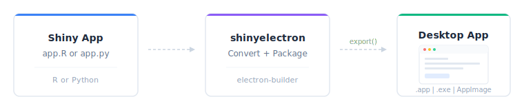

<!-- README.md is generated from README.qmd. Please edit that file -->

# shinyelectron <a href="https://r-pkg.thecoatlessprofessor.com/shinyelectron/" alt="shinyelectron"><picture><source media="(prefers-color-scheme: dark)" srcset="man/figures/logo-shinyelectron-light-animated.svg"></picture></a>

<!-- badges: start -->

[](https://github.com/coatless-rpkg/shinyelectron/actions/workflows/R-CMD-check.yaml)


<!-- badges: end -->

Turn any Shiny app (R or Python) into a standalone desktop application
that runs on macOS, Windows, and Linux. No web server, no browser tab,
no deployment infrastructure. Just an `.app`, `.exe`, or AppImage your
users double-click to open.

<picture><source srcset="man/figures/pipeline-overview-dark.svg" media="(prefers-color-scheme: dark)" /></picture>

> [!IMPORTANT]
>
> This package is currently in the prototype/experimental stage. It is
> not yet on CRAN and may have rough edges. **Not recommended for
> production applications at this time.**

## Private and local R packages

R packages do not need to be published on CRAN to ship with a desktop app.
With `runtime_strategy = "bundled"`, shinyelectron can install packages
directly from GitHub or the build machine and embed them in the app's private R
library. End users do not need R, the original package directory, repository
access, or credentials. Bundling is distribution, not source-code protection:
installed package contents remain inspectable by a determined user.

For example, a Windows user might keep an app and two unpublished packages in
one project:

``` text
C:/Users/alex/Documents/acme-desktop/
|-- shiny-app/
|   |-- app.R
|   `-- _shinyelectron.yml
|-- packages/
|   |-- acmeData/
|   |   |-- DESCRIPTION
|   |   `-- R/
|   `-- acmeReports_2.1.0.tar.gz
`-- builds/
```

The fake `shiny-app/_shinyelectron.yml` would look like this:

``` yaml
dependencies:
  r:
    packages:
      # Public GitHub repository; @ref may be a branch, tag, or commit
      - github::owner/package@v1.2.0

      # Use an alias when the repository and R package names differ
      - acmeTheme=github::acme-corp/acme-shiny-theme@main

      # Resolved relative to the Shiny app directory
      - acmeData=local::../packages/acmeData

      # A versioned local source archive works too
      - acmeReports=local::../packages/acmeReports_2.1.0.tar.gz
```

The user can then build from any R working directory by using explicit paths:

``` r
project_dir <- "C:/Users/alex/Documents/acme-desktop"

export(
  appdir = file.path(project_dir, "shiny-app"),
  destdir = file.path(project_dir, "builds", "acme-desktop-app"),
  app_name = "Acme Analytics",
  runtime_strategy = "bundled",
  overwrite = TRUE
)
```

The `local::../packages/...` paths are evaluated from `shiny-app`, where the
YAML file lives, not from the current R working directory. The resulting Windows
installer is written beneath
`builds/acme-desktop-app/electron-app/dist/`.

Public GitHub and local packages require no credentials. Private GitHub
repositories use `GITHUB_PAT` or `GH_TOKEN` from the build environment.
Tokens are build-time secrets: they are not required by end users and must
never be placed in app source, `_shinyelectron.yml`, or an installer.
Relative local paths and pinned source archives are the simplest reproducible
option for internal or corporate builds.

## Install

``` r
# install.packages("pak")
pak::pak("coatless-rpkg/shinyelectron")
```

## Quick start

``` r
library(shinyelectron)

# Check your system
sitrep_shinyelectron()

# Try a bundled demo
export(
  appdir  = example_app("r"),
  destdir = "~/Desktop/my-first-app",
  run_after = TRUE
)
```

That’s the whole workflow: one call converts your app, wraps it in
Electron, builds a distributable, and launches it. Takes about a minute
for a small app.

## Try a prebuilt demo

Each demo is packaged as a desktop app. These are `shinylive` builds, so
they need no R, Python, or internet: everything runs inside the app.
Download the installer for your platform, run it, and launch the demo.
On Linux the download is a portable AppImage you can run straight away.

| Demo | macOS (Apple) | macOS (Intel) | Windows | Linux |
|----|----|----|----|----|
| Python demo suite | [download](https://github.com/coatless-rpkg/shinyelectron/releases/latest/download/demo-py-app-suite-shinylive-mac-arm64.dmg) | [download](https://github.com/coatless-rpkg/shinyelectron/releases/latest/download/demo-py-app-suite-shinylive-mac-x64.dmg) | [download](https://github.com/coatless-rpkg/shinyelectron/releases/latest/download/demo-py-app-suite-shinylive-win-x64.exe) | [download](https://github.com/coatless-rpkg/shinyelectron/releases/latest/download/demo-py-app-suite-shinylive-linux-x64.AppImage) |
| Python single app | [download](https://github.com/coatless-rpkg/shinyelectron/releases/latest/download/demo-py-single-shinylive-mac-arm64.dmg) | [download](https://github.com/coatless-rpkg/shinyelectron/releases/latest/download/demo-py-single-shinylive-mac-x64.dmg) | [download](https://github.com/coatless-rpkg/shinyelectron/releases/latest/download/demo-py-single-shinylive-win-x64.exe) | [download](https://github.com/coatless-rpkg/shinyelectron/releases/latest/download/demo-py-single-shinylive-linux-x64.AppImage) |
| R demo suite | [download](https://github.com/coatless-rpkg/shinyelectron/releases/latest/download/demo-r-app-suite-shinylive-mac-arm64.dmg) | [download](https://github.com/coatless-rpkg/shinyelectron/releases/latest/download/demo-r-app-suite-shinylive-mac-x64.dmg) | [download](https://github.com/coatless-rpkg/shinyelectron/releases/latest/download/demo-r-app-suite-shinylive-win-x64.exe) | [download](https://github.com/coatless-rpkg/shinyelectron/releases/latest/download/demo-r-app-suite-shinylive-linux-x64.AppImage) |
| R single app | [download](https://github.com/coatless-rpkg/shinyelectron/releases/latest/download/demo-single-shinylive-mac-arm64.dmg) | [download](https://github.com/coatless-rpkg/shinyelectron/releases/latest/download/demo-single-shinylive-mac-x64.dmg) | [download](https://github.com/coatless-rpkg/shinyelectron/releases/latest/download/demo-single-shinylive-win-x64.exe) | [download](https://github.com/coatless-rpkg/shinyelectron/releases/latest/download/demo-single-shinylive-linux-x64.AppImage) |

Other strategies (bundled, system, auto-download, container) are
published too. See the [download-demos
guide](https://r-pkg.thecoatlessprofessor.com/shinyelectron/articles/download-demos.html)
for the full set and what each one needs, or browse the [releases
page](https://github.com/coatless-rpkg/shinyelectron/releases/latest).

> [!NOTE]
>
> The macOS demos are signed and notarized under our Apple Developer
> Program membership (\$99/year), so they open cleanly. The Windows
> demos are unsigned, so the first launch shows a Microsoft Defender
> SmartScreen prompt: choose **More info**, then **Run anyway**. If you
> distribute your own apps, you will need to pay for code signing on
> each platform to avoid these prompts, a recurring budget line item for
> organizations. Our development is on macOS and Linux, so if you would
> like to help fund a Windows certificate for these demos, sponsorship
> is welcome at
> [github.com/sponsors/coatless](https://github.com/sponsors/coatless).

## What you can export

shinyelectron supports two app types, autodetected from the contents of
your `appdir`:

- `r-shiny`: detected from `app.R` or `ui.R` + `server.R`
- `py-shiny`: detected from `app.py`

Both types work with five **runtime strategies** for delivering the app
to the end user:

| Strategy | What Ships | First Launch | User Needs | Best For |
|----|----|----|----|----|
| `shinylive` | Electron + WASM bundle | Instant, offline | Nothing | Simple apps; deps that run in WebR or Pyodide (default) |
| `bundled` | Electron + R/Python runtime | Instant, offline | Nothing | Offline distribution; predictable runtime |
| `auto-download` | Electron + downloader | Needs internet | Nothing | Public distribution; smaller download |
| `system` | Electron only | Finds R/Python on PATH | R or Python pre-installed | Internal tools for users who already have R or Python |
| `container` | Electron + container config | Needs Docker | Docker or Podman | Complex system deps; reproducibility |

`shinylive` is the default when `runtime_strategy` is not set. See the
[Runtime Strategies
guide](https://r-pkg.thecoatlessprofessor.com/shinyelectron/articles/runtime-strategies.html)
for the full decision matrix.

> [!NOTE]
>
> **Linux note for `r-shiny`:** the `bundled` and `auto-download`
> strategies rely on the [portable-r](https://github.com/portable-r)
> project, which currently publishes builds for macOS and Windows only.
> On Linux, use `shinylive`, `system` (the user has R installed), or
> `container` (Docker or Podman). Python apps work with all strategies
> on Linux via
> [python-build-standalone](https://github.com/astral-sh/python-build-standalone).

## Prerequisites

These are required on the **build machine** (where you run `export()`).
What end users need depends on the runtime strategy: nothing for
`shinylive`, `bundled`, or `auto-download`; R or Python pre-installed
for `system`; Docker or Podman for `container`.

- **R** (\>= 4.4.0)
- **Node.js** (\>= 22.0.0): run `install_nodejs()` to install locally
  without admin rights
- **npm** (\>= 11.5.0): included with Node.js

Platform build tools:

| Platform | Requirement                   |
|----------|-------------------------------|
| macOS    | Xcode Command Line Tools      |
| Windows  | Visual Studio Build Tools     |
| Linux    | `build-essential` (gcc, make) |

> [!TIP]
>
> Run `sitrep_shinyelectron()` to verify your system is ready before
> your first export. It checks everything above and tells you what’s
> missing.

## Learn more

- [Getting
  Started](https://r-pkg.thecoatlessprofessor.com/shinyelectron/articles/getting-started.html):
  step-by-step tutorial
- [Configuration
  Guide](https://r-pkg.thecoatlessprofessor.com/shinyelectron/articles/configuration.html):
  `_shinyelectron.yml` reference
- [Runtime
  Strategies](https://r-pkg.thecoatlessprofessor.com/shinyelectron/articles/runtime-strategies.html):
  bundled vs system vs auto-download vs container
- [Multi-App
  Suites](https://r-pkg.thecoatlessprofessor.com/shinyelectron/articles/multi-app-suites.html):
  bundle multiple apps in one shell
- [Code
  Signing](https://r-pkg.thecoatlessprofessor.com/shinyelectron/articles/code-signing.html):
  macOS GateKeeper and Windows SmartScreen
- [Troubleshooting](https://r-pkg.thecoatlessprofessor.com/shinyelectron/articles/troubleshooting.html):
  common issues and fixes

## Acknowledgements

Turning Shiny apps into desktop apps is a problem many people have
attacked over the years. shinyelectron stands on the shoulders of prior
packaging attempts, community tutorials, and the broader WebR / Pyodide
/ Electron ecosystems. The list below credits the specific projects
whose approaches directly informed this one; we’re grateful to the much
larger community of contributors experimenting in this space.

### Prior packaging attempts

- [electricShine](https://chasemc.github.io/electricShine/): R package
  that streamlines distributable Shiny Electron apps via its
  `electrify()` function; automates Windows builds.
- [Photon](https://github.com/COVAIL/photon): RStudio add-in that
  leverages Electron to build standalone Shiny apps for macOS and
  Windows by cloning an R-specific
  [`electron-quick-start`](https://github.com/COVAIL/electron-quick-start)
  repository and including portable R versions.
- [RInno](https://github.com/ficonsulting/RInno): standalone R
  application builder with Electron on Windows.
- [DesktopDeployR](https://github.com/wleepang/DesktopDeployR):
  alternative framework for deploying self-contained R-based
  applications with a portable R environment and private package
  library.

### Talks, tutorials, and templates

- **UseR! 2018**: [Shiny meets
  Electron](https://www.youtube.com/watch?v=ARrbbviGvjc) by @ksasso
  demonstrating how to convert Shiny apps into standalone desktop apps.
- **Developer tutorials**: step-by-step guides from
  [@lawalter](https://github.com/lawalter/r-shiny-electron-app) and
  [@dirkschumacher](https://github.com/dirkschumacher/r-shiny-electron)
  on practical integration.
- **Zarathu Corporation templates**: cross-platform deployment templates
  for [macOS
  ARM](https://github.com/zarathucorp/shiny-electron-template-m1) and
  [Windows](https://github.com/zarathucorp/shiny-electron-template-windows),
  summarized in this [R-bloggers
  post](https://www.r-bloggers.com/2023/03/creating-standalone-apps-from-shiny-with-electron-2023-macos-m1/).

### Upstream projects

- [Electron](https://electronjs.org/docs/latest/tutorial/application-distribution):
  the desktop framework.
- [electron-builder](https://www.electron.build/): the packaging
  pipeline that produces platform installers.
- [shinylive](https://github.com/posit-dev/r-shinylive) (Posit) and
  [WebR](https://docs.r-wasm.org/webr/): R in WebAssembly, enabling
  browser-only Shiny apps.
- [py-shinylive](https://github.com/posit-dev/py-shinylive) and
  [Pyodide](https://pyodide.org/): the Python equivalents.
- [portable-r](https://github.com/portable-r): standalone R binaries
  used by the `bundled` and `auto-download` strategies.
- [python-build-standalone](https://github.com/astral-sh/python-build-standalone):
  standalone Python builds used by the Python strategies.

## License

AGPL (\>= 3)

## References

- [`electricShine` (R
  package)](https://chasemc.github.io/electricShine/)
- [`RInno` (R package)](https://github.com/ficonsulting/RInno)
- [`Photon` (RStudio Add-in)](https://github.com/COVAIL/photon)
- [`COVAIL`
  electron-quick-start](https://github.com/COVAIL/electron-quick-start)
- [`DesktopDeployR`
  (framework)](https://github.com/wleepang/DesktopDeployR)
- [Electron ShinyApp Deployment by
  @ksasso](https://github.com/ksasso/Electron_ShinyApp_Deployment)
- [How to Make an R Shiny Electron App by
  @lawalter](https://github.com/lawalter/r-shiny-electron-app)
- [R Shiny and Electron by
  @dirkschumacher](https://github.com/dirkschumacher/r-shiny-electron)
- [Creating Standalone Shiny Apps with Electron on macOS
  M1](https://github.com/zarathucorp/shiny-electron-template-m1)
- [Creating Standalone Shiny Apps with Electron on Windows by
  @jhk0530](https://github.com/zarathucorp/shiny-electron-template-windows)
- [Creating Standalone Apps from Shiny with Electron (R-bloggers) by
  @jhk0530](https://www.r-bloggers.com/2023/03/creating-standalone-apps-from-shiny-with-electron-2023-macos-m1/)
- [Shiny meets Electron (UseR! 2018
  talk)](https://www.youtube.com/watch?v=ARrbbviGvjc) ([slides and
  code](https://github.com/ksasso/useR_electron_meet_shiny/))
- [Electron
  documentation](https://electronjs.org/docs/latest/tutorial/application-distribution)
- [electron-builder documentation](https://www.electron.build/)
- [shinylive (R)](https://github.com/posit-dev/r-shinylive)
- [py-shinylive (Python)](https://github.com/posit-dev/py-shinylive)
- [WebR](https://docs.r-wasm.org/webr/)
- [Pyodide](https://pyodide.org/)
- [portable-r (macOS / Windows builds)](https://github.com/portable-r)
- [python-build-standalone](https://github.com/astral-sh/python-build-standalone)
