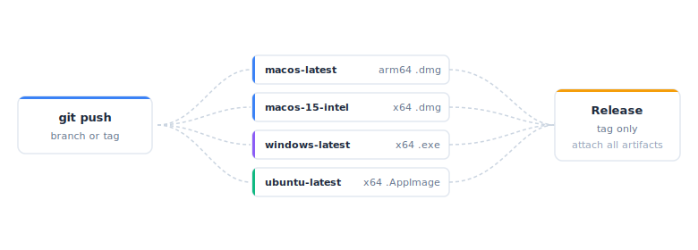

```{r}
#| include: false
library(shinyelectron)

# Show the bundled workflow verbatim so the vignette stays in sync with what
# shinyelectron actually ships.
show_template <- function() {
  path <- system.file(
    "templates", "github-actions-build.yml",
    package = "shinyelectron"
  )
  cat(c("```yaml", readLines(path), "```"), sep = "\n")
}
```

A desktop installer has to be built on the OS it targets: a `.dmg` on macOS, an `.exe` on Windows, and an `.AppImage` on Linux. That is four builds for full coverage, and most teams do not have all four machines on a desk. GitHub Actions rents them by the minute, runs them in parallel, and hands back the installers as artifacts. One push, four builds, no hardware juggling.

<figure><picture><source srcset="../man/figures/ci-build-matrix-dark.svg" media="(prefers-color-scheme: dark)" /></picture><figcaption>The build matrix: one push fans out across platform runners, each producing an installer; a tag push adds a release job that attaches them all.</figcaption></figure>

## Why automate

Doing this by hand is slow and hard to reproduce. CI fixes four specific things at once:

| Problem | What CI gives you |
|---------|-------------------|
| You need macOS, Windows, and Linux hardware | Hosted runners for each |
| Local builds drift with your laptop's state | Fresh, versioned environments every run |
| Uploading binaries to a Release page by hand | Artifacts and releases produced by a workflow step |
| Platform-specific regressions slip through | The matrix runs in parallel and surfaces them on every push |

## Before you start

You need:

1. A GitHub repo containing your Shiny app.
2. The app in a subdirectory, `app/` by default.
3. Optionally, a `_shinyelectron.yml` alongside the app.

A typical layout:

```
my-shiny-project/
├── .github/
│   └── workflows/
│       └── build-electron.yml
├── app/
│   ├── app.R
│   └── ...
├── _shinyelectron.yml
└── README.md
```

## Use the bundled workflow

shinyelectron ships a ready-to-run workflow at `inst/templates/github-actions-build.yml`. It leans on the [`coatless-actions/shiny-to-electron`](https://github.com/coatless-actions/shiny-to-electron) action, which sets up R and Node.js, installs shinyelectron, runs `export()`, and uploads the installer. That keeps the workflow itself short:

```{r}
#| echo: false
#| results: asis
show_template()
```

Copy it into your repo:

```{r}
#| eval: false
template <- system.file(
  "templates", "github-actions-build.yml",
  package = "shinyelectron"
)

dir.create(".github/workflows", recursive = TRUE, showWarnings = FALSE)
file.copy(
  template,
  ".github/workflows/build-electron.yml"
)
```

Or grab it directly from [GitHub](https://github.com/coatless-rpkg/shinyelectron/blob/main/inst/templates/github-actions-build.yml).

Two jobs run: a build matrix across four platform runners, and a release job gated on tag pushes.

### Configure it

Set two things in the build step's `with:` block: `appdir` (the path to your Shiny app inside the repo) and `app-name` (the installer's display name). Everything else has a sensible default. Uncomment `runtime-strategy` to pick a strategy other than `shinylive`, and `sign` to sign builds (see [Signing in CI](#signing-in-ci)).

### What the matrix builds

The matrix spreads installers across four runners. Each runner starts from a clean image:

| Runner | Platform | Architecture | Output |
|--------|----------|--------------|--------|
| `macos-latest` | macOS | arm64 (Apple Silicon) | `.dmg` |
| `macos-15-intel` | macOS | x64 (Intel) | `.dmg` |
| `windows-latest` | Windows | x64 | `.exe` |
| `ubuntu-latest` | Ubuntu | x64 | `.AppImage` |

CPU and RAM allocations come from GitHub's hosted-runner specs, which evolve over time; check [the GitHub-hosted runners documentation](https://docs.github.com/en/actions/using-github-hosted-runners/about-github-hosted-runners) for current numbers.

Each runner does the same two things: check out the repo, then run the action, which sets up R and Node.js, installs shinyelectron, runs `export()` for that platform, and uploads the installer as a run artifact. On a tag push, the release job downloads every artifact and attaches them to a fresh GitHub Release.

### Push and tag

Commit and push to fire the workflow on `main` or `master`:

```bash
git add .github/workflows/build-electron.yml
git commit -m "Add Electron build workflow"
git push
```

Tag a version to cut a release:

```bash
git tag v1.0.0
git push origin v1.0.0
```

Tags containing `-alpha` or `-beta` are marked as pre-releases automatically.

### Status badge

Drop a badge in your README so contributors see build state at a glance:

```markdown
[](https://github.com/YOUR-USERNAME/YOUR-REPO/actions/workflows/build-electron.yml)
```

## Customising

The action exposes an input for most things a project changes. Set them in the build step's `with:` block; anything not listed there falls back to `_shinyelectron.yml` or the defaults.

### App in a different folder

Point `appdir` at your app:

```yaml
      - uses: coatless-actions/shiny-to-electron@v1
        with:
          appdir: src/shiny-app
          app-name: MyApp
```

### Narrower platform list

Trim the matrix to what you ship. Each entry corresponds to one runner; remove the rest:

```yaml
    strategy:
      matrix:
        include:
          - { os: macos-latest,   platform: mac, arch: arm64 }
          - { os: windows-latest, platform: win, arch: x64 }
```

### Runtime strategy

The default is `shinylive`. Choose another with the `runtime-strategy` input, or set it in `_shinyelectron.yml`:

```yaml
      - uses: coatless-actions/shiny-to-electron@v1
        with:
          appdir: app
          app-name: MyApp
          runtime-strategy: bundled
```

### Icons and other options

The action does not take an icon input. Put project settings like the icon in a `_shinyelectron.yml` next to your app; `export()` reads it automatically. See the [Configuration Guide](configuration.html) for every option.

```yaml
app:
  name: "My Shiny Dashboard"
  version: "1.0.0"

build:
  runtime_strategy: "shinylive"
```

### Config file wins, action inputs override

A `_shinyelectron.yml` in the app directory is picked up automatically. Action inputs override its values when they are set, so you can keep shared settings in the config and vary only the CI-specific ones in the workflow.

## Signing in CI {#signing-in-ci}

Signing uses the same `electron-builder` credentials as a local build, stored as GitHub Secrets. Add each under Settings, Secrets and variables, Actions, then pass them to the build job's `env` and flip `sign` on:

```yaml
  build:
    runs-on: ${{ matrix.os }}
    env:
      CSC_LINK: ${{ secrets.CSC_LINK }}                                  # base64 .p12 signing certificate
      CSC_KEY_PASSWORD: ${{ secrets.CSC_KEY_PASSWORD }}
      APPLE_ID: ${{ secrets.APPLE_ID }}
      APPLE_APP_SPECIFIC_PASSWORD: ${{ secrets.APPLE_APP_SPECIFIC_PASSWORD }}
      APPLE_TEAM_ID: ${{ secrets.APPLE_TEAM_ID }}
    steps:
      - uses: actions/checkout@v7
      - uses: coatless-actions/shiny-to-electron@v1
        with:
          appdir: app
          app-name: MyApp
          platform: ${{ matrix.platform }}
          arch: ${{ matrix.arch }}
          sign: 'true'
```

With `sign: 'true'` and those variables present, macOS builds are signed with your Developer ID and notarized, taking the team id from `APPLE_TEAM_ID`. Leave the credentials out and macOS still falls back to an ad-hoc signature, so the app launches through the standard unidentified-developer prompt rather than reading as damaged.

::: {.callout-warning}
Certificates come from Apple (macOS) and a commercial CA (Windows). Unsigned apps trigger Gatekeeper and SmartScreen warnings on end-user machines. Storing a signing key in CI means it is decrypted into the runner during the build, so weigh that against how the apps are distributed. See [Code Signing and Distribution](code-signing.html) for the full setup.
:::

## Roll your own

If you need full control, custom steps, bespoke signing, or extra tooling, skip the action and drive `shinyelectron::export()` yourself. The action is a thin wrapper around exactly this recipe:

```yaml
jobs:
  build:
    name: Build (${{ matrix.platform }}-${{ matrix.arch }})
    runs-on: ${{ matrix.os }}
    strategy:
      fail-fast: false
      matrix:
        include:
          - { os: macos-latest,   platform: mac,   arch: arm64 }
          - { os: macos-15-intel, platform: mac,   arch: x64 }
          - { os: windows-latest, platform: win,   arch: x64 }
          - { os: ubuntu-latest,  platform: linux, arch: x64 }
    steps:
      - uses: actions/checkout@v7

      - uses: r-lib/actions/setup-r@v2
        with:
          r-version: release
          use-public-rspm: true

      - uses: actions/setup-node@v6
        with:
          node-version: '22'

      - name: Install system dependencies (Linux)
        if: runner.os == 'Linux'
        run: sudo apt-get update && sudo apt-get install -y libcurl4-openssl-dev

      - uses: r-lib/actions/setup-r-dependencies@v2
        with:
          extra-packages: |
            github::coatless-rpkg/shinyelectron
            any::shinylive
          needs: build

      - name: Build the Electron app
        shell: Rscript {0}
        run: |
          library(shinyelectron)
          export(
            appdir  = "app",
            destdir = "build",
            app_name = "MyApp",
            platform = "${{ matrix.platform }}",
            arch     = "${{ matrix.arch }}",
            overwrite = TRUE,
            verbose   = TRUE
          )

      - uses: actions/upload-artifact@v7
        with:
          name: MyApp-${{ matrix.platform }}-${{ matrix.arch }}
          path: build/electron-app/dist/**
```

Drive signing from the same `export(sign = TRUE)` call with the `CSC_*` and `APPLE_*` variables in the step's `env`, exactly as above. This is the path to reach for when you want to split building from signing, add caching, or run steps the action does not expose.

## CI-specific troubleshooting

The general guide in [Troubleshooting](troubleshooting.html) covers symptoms that show up on any machine. The items below are CI-only or turn up much more often on hosted runners than on a developer laptop.

### `appdir` points at the wrong directory

A build fails with `App directory 'app' not found` when your Shiny code lives somewhere other than `app/`. Set the `appdir` input to the actual path.

### Linux build fails on missing libraries

Hosted Ubuntu runners are minimal. If your R or Python dependencies need system packages that the build does not install, add them in your own workflow (the roll-your-own recipe above) before the build step:

```yaml
- name: Install system dependencies (Linux)
  if: runner.os == 'Linux'
  run: |
    sudo apt-get update
    sudo apt-get install -y libcurl4-openssl-dev libxml2-dev
```

### Pin the shinyelectron version

By default the action installs shinyelectron from GitHub. Pin a tag or branch with the `shinyelectron-source` input so a build is reproducible:

```yaml
      - uses: coatless-actions/shiny-to-electron@v1
        with:
          appdir: app
          shinyelectron-source: github::coatless-rpkg/shinyelectron@v0.2.0
```

### Job hits the six-hour limit

GitHub-hosted runners cap individual jobs at six hours. If a build comes close, shrink the matrix or split the build into separate workflows that run in parallel.

## Next steps

- [Getting Started](getting-started.html): local development workflow.
- [Configuration](configuration.html): customize with `_shinyelectron.yml`.
- [Code Signing](code-signing.html): sign and notarize for distribution.
- [Troubleshooting](troubleshooting.html): diagnose build issues.
